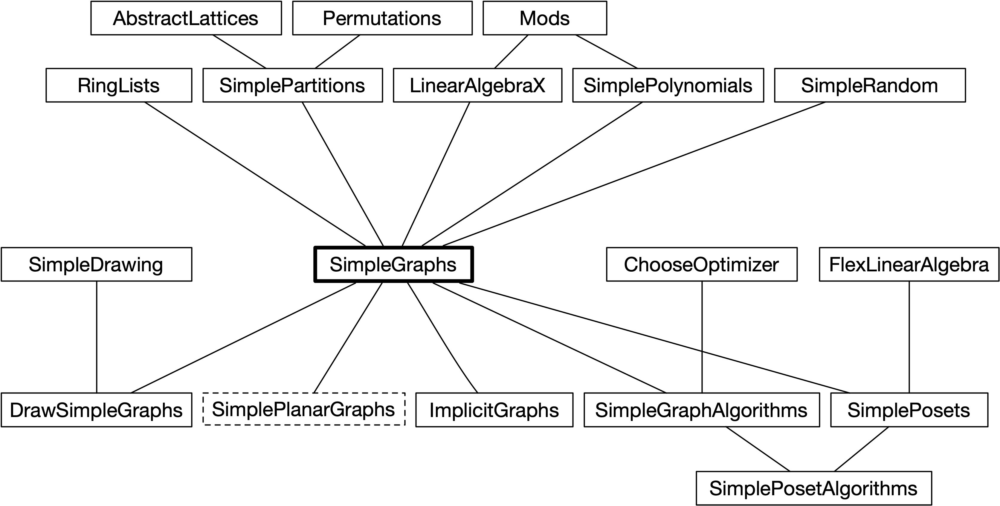

# Welcome

Welcome to my GitHub site. I am a professor at [Johns Hopkins University](https://www.jhu.edu/) working in discrete mathematics. I'm the author of
+ [*The Mathematics Lover's Companion*](https://www.ams.jhu.edu/ers/books/math-lovers-companion/),
+ [*Mathematical Notation: A Guide for Engineers and Scientsists*](https://www.ams.jhu.edu/ers/books/mathematical-notation/),
+ [*Mathematics: A Discrete Introduction*](https://www.ams.jhu.edu/ers/books/mathematics-a-discrete-introduction/),

and several [others](https://www.ams.jhu.edu/ers/books/).

I am also an amateur coder and [Julia](https://julialang.org/) enthusiast. I hope you find the packages provided here useful.

## Postcardware

The packages in my GitHub are under the MIT License which is very permissive. While it is not necessary (legally)
I do ask that if you find the code useful to send me a postcard. While I'd enjoy a real, physical postcard, an
electronic substitute is perfectly fine. Send me a photo of your home town, your university, your dog, yourself, or whatever
interesting image you'd like. My email address is <ers@jhu.edu>.

To send a physical postcard, please use this address:

> Ed Scheinerman  
> Whiting School of Engineering Dean's Office 
> Johns Hopkins University 
> 3500 San Martin Drive, First Floor 
> Baltimore, MD 21218 USA

And thanks!

## Graph Theory

The bulk of my code is in support of my interest in [graph theory](https://en.wikipedia.org/wiki/Graph_theory). 
The following diagram shows various modules (and their dependencies) available 
here with [SimpleGraphs](https://github.com/scheinerman/SimpleGraphs.jl) being the centerpiece. (Several other modules are excluded.)

## Contributing

I'm not fully comfortable with all the functionality of GitHub and my understanding of pull requests (and their management)
is marginal at best. If you want to add some functionality to a package, please reach out to me directly. The easiest 
thing for me is if your new code sits in its own file.

### Current Need

I have recently updated my [SimpleGraphs](https://github.com/scheinerman/SimpleGraphs.jl) module to include rotation
systems (combinatorial embeddings on orientable surfaces). I have started a bare-bones 
[SimplePlanarGraphs](https://github.com/scheinerman/SimplePlanarGraphs.jl) module. 
Help on this would be welcome, especialy if you're a JHU undergradaute student.

## My Programming Journey

Here's a list of languages I've used over the years.

### Used a lot

* Fortran
* Basic
* APL
* PL/1
* Z80 machine code
* C
* C++
* Hypercard/AppleScript
* Java
* MATLAB
* Mathematica
* Python
* Julia

### Used a bit

* SNOBOL
* Maple
* Pascal
* Perl
* Haskell
* bash
* Forth
* Postscript

### Markup languages

* Script
* nroff
* LaTeX
* HTML
* Markdown

<!--
**scheinerman/scheinerman** is a ✨ _special_ ✨ repository because its `README.md` (this file) appears on your GitHub profile.

Here are some ideas to get you started:

- 🔭 I’m currently working on ...
- 🌱 I’m currently learning ...
- 👯 I’m looking to collaborate on ...
- 🤔 I’m looking for help with ...
- 💬 Ask me about ...
- 📫 How to reach me: ...
- 😄 Pronouns: ...
- ⚡ Fun fact: ...
-->
